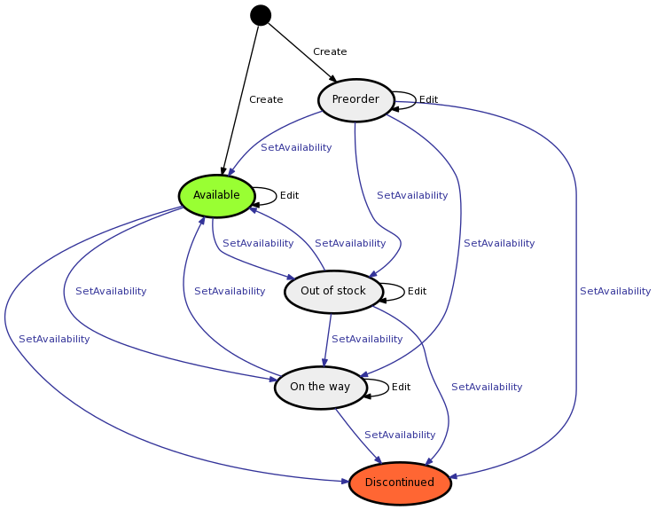
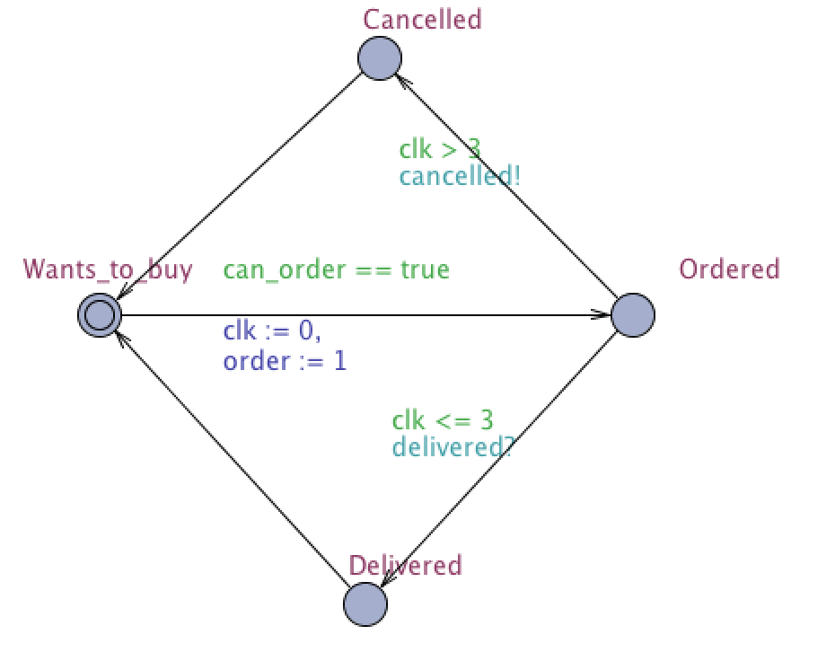
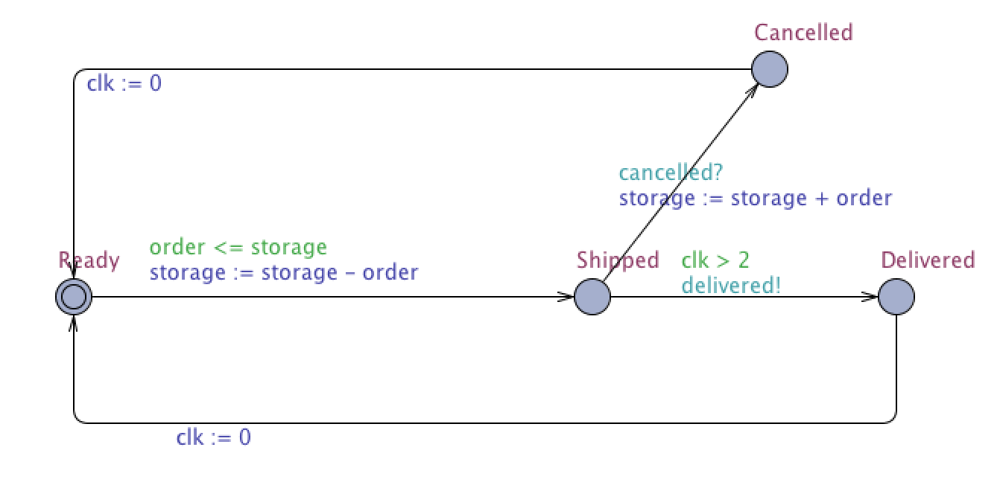
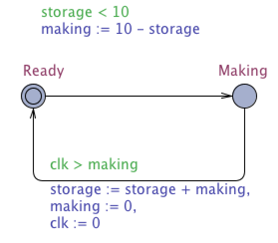
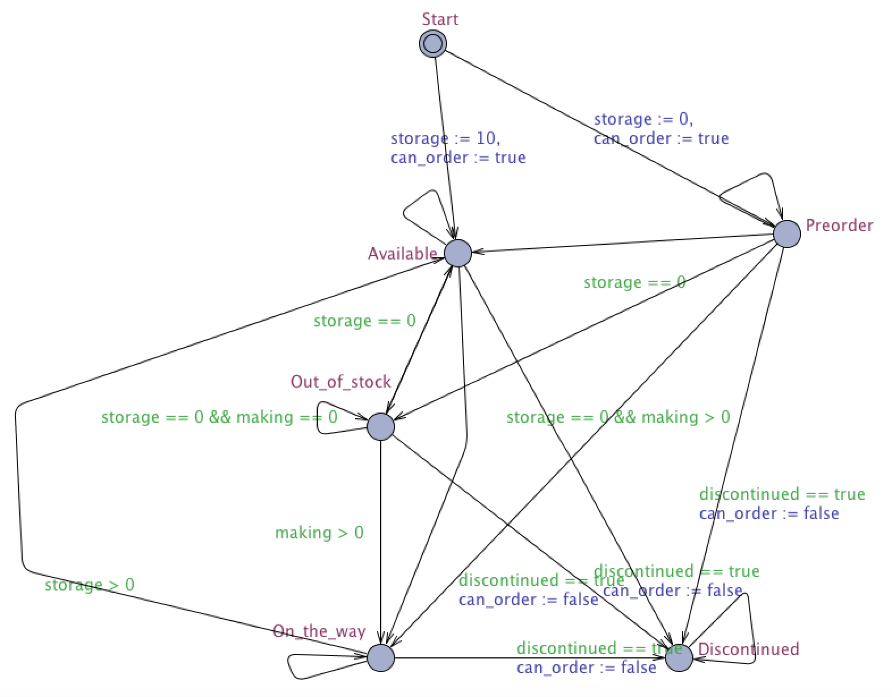
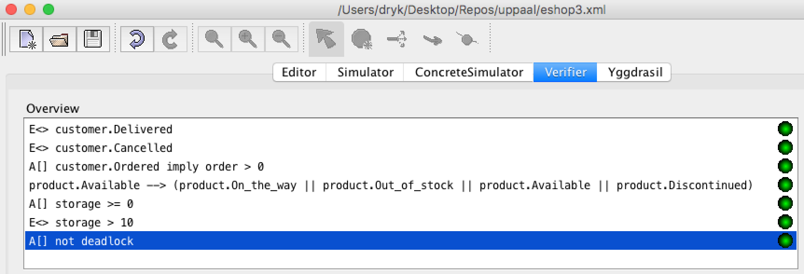

TVS Semestrální úloha (skupina 13)
=================

## Zadání:

Zboží v e-shopu

- Z aplikace získejte definici stavového automatu (jednu entitu dle vašeho téma) a importujte ji do Uppallu.
- Vymodelujte v Uppallu další entity, například uživatele, tak aby byly použity alespoň dvoje hodiny.
- Simulujte chování systému a dokažte nějaké zajímavé vlastnosti.

Stavový diagram:

## Vymodelované entity

### Zákazník

Zákazník objednává zboží.
Zboží objednává pouze v případě, kdy je objednatelné.
To znamená že není ve stavu _Discontinued_.
Potom čeká, než mu zboží obchod doručí. 
Pokud ale obchod zboží z nějakého důvodu nedoručí včas, zákazník objednávku zruší.

### Obchod

Obchod vyřizuje objednávky, takže pokud má objednávku a dostatek zboží na skladě, aby objednávku vyřešil, tak objednávku odešle.
Pokud mu ale zákazník objednávku zruší, dostane zboží zpět na sklad.

### Továrna

Továrna vyrábí zboží, pokud ve sklad není plný (10+).
Trvá jí ale nějaký čas, než zboží vyrobí a dodá do skladu.
Tento čas záleží na množství produktu, který vyrábí.

### Produkt

Tato entita reprezentuje původní stavový diagram. 
Přechází do stavů podle stavu skladu a továrny.
Do stavu _Discontinued_ se nemůže nikdy dostane, protože jsme pro něj nenašli rozumné využití.

## Verifikace modelu

- `E<> customer.Delivered`

    Existuje cesta, kde zákazník dostane svoje zboží

- `E<> customer.Cancelled`

    Existuje cesta, kde zákazník zruší objednávku.

- `A[] customer.Ordered imply order > 0`

    Vždy platí, že pokud si zákazník objednal, objednávka je na více než 0 kusů.

- `product.Available --> (product.On_the_way || product.Out_of_stock || product.Available || product.Discontinued)`
    
    Pokud už produkt jednou byl _Available_, nedostane se nikdy do stavu _Preorder_.

- `A[] storage >= 0`

    Vždy platí, že ve skladu nemůže být záporný počet kusů.

- `E[] storage > 10`

    Existuje cesta, kde se ocitnem s přeplněným skladem (Zákazník si objedná, továrna doplní sklad a zákazník stornuje objednávku).

- `A[] not deadlock`

    Nikdy se neocitneme ve slepé uličce, tz. stavu kde už nemáme kam dále jít.
    
