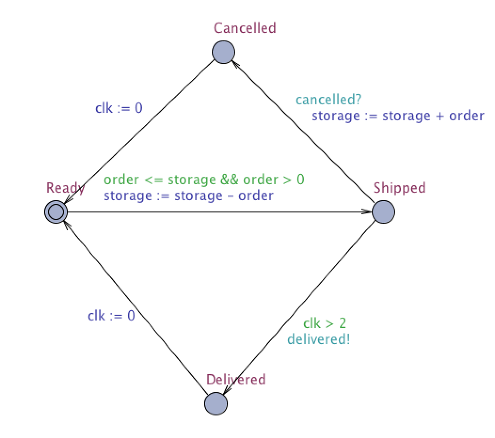

TVS Semestrální úloha (skupina 13)
=================

## Zadání:

Zboží v e-shopu

- Z aplikace získejte definici stavového automatu (jednu entitu dle vašeho téma) a importujte ji do Uppallu.
- Vymodelujte v Uppallu další entity, například uživatele, tak aby byly použity alespoň dvoje hodiny.
- Simulujte chování systému a dokažte nějaké zajímavé vlastnosti.

Stavový diagram:

## Vymodelované entity

## Verifikace modelu